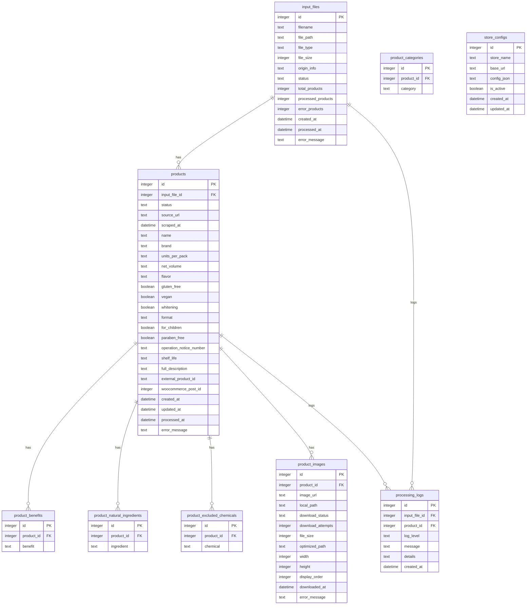

```mermaid
erDiagram
    input_files {
        integer id PK
        text filename
        text file_path
        text file_type
        integer file_size
        text origin_info
        text status
        integer total_products
        integer processed_products
        integer error_products
        datetime created_at
        datetime processed_at
        text error_message
    }

    products {
        integer id PK
        integer input_file_id FK
        text status
        text source_url
        datetime scraped_at
        text name
        text brand
        text units_per_pack
        text net_volume
        text flavor
        boolean gluten_free
        boolean vegan
        boolean whitening
        text format
        boolean for_children
        boolean paraben_free
        text operation_notice_number
        text shelf_life
        text full_description
        text external_product_id
        integer woocommerce_post_id
        datetime created_at
        datetime updated_at
        datetime processed_at
        text error_message
    }

    product_benefits {
        integer id PK
        integer product_id FK
        text benefit
    }

    product_natural_ingredients {
        integer id PK
        integer product_id FK
        text ingredient
    }

    product_categories {
        integer id PK
        integer product_id FK
        text category
    }

    product_excluded_chemicals {
        integer id PK
        integer product_id FK
        text chemical
    }

    product_images {
        integer id PK
        integer product_id FK
        text image_url
        text local_path
        text download_status
        integer download_attempts
        integer file_size
        text optimized_path
        integer width
        integer height
        integer display_order
        datetime downloaded_at
        text error_message
    }

    processing_logs {
        integer id PK
        integer input_file_id FK
        integer product_id FK
        text log_level
        text message
        text details
        datetime created_at
    }

    store_configs {
        integer id PK
        text store_name
        text base_url
        text config_json
        boolean is_active
        datetime created_at
        datetime updated_at
    }

    input_files ||--o{ products : "has"
    input_files ||--o{ processing_logs : "logs"
    products ||--o{ product_benefits : "has"
    products ||--o{ product_natural_ingredients : "has"
    products ||--o{ product_excluded_chemicals : "has"
    products ||--o{ product_images : "has"
    products ||--o{ processing_logs : "logs"
    
    %% Cardinality and Relationship Notes:
    %% - One input_file can have many products (1:N)
    %% - One product can have many benefits (1:N)
    %% - One product can have many natural ingredients (1:N)
    %% - One product can have many excluded chemicals (1:N)
    %% - One product can have many images (1:N)
    %% - Both input_files and products can have many processing_logs (1:N)
```